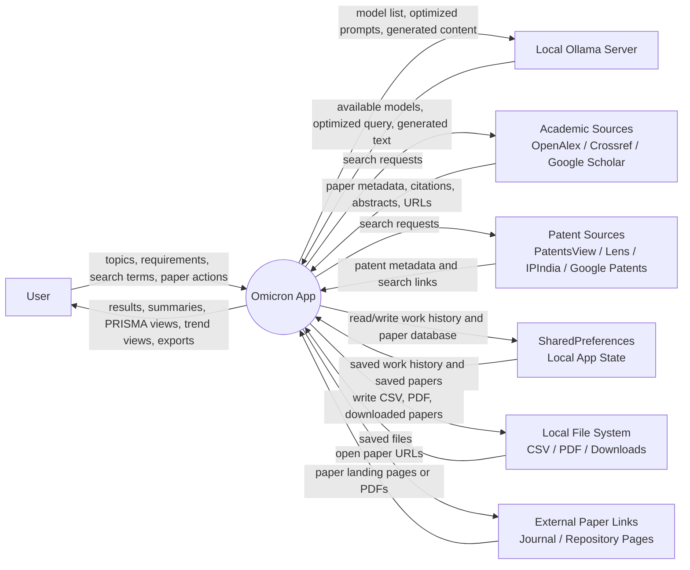
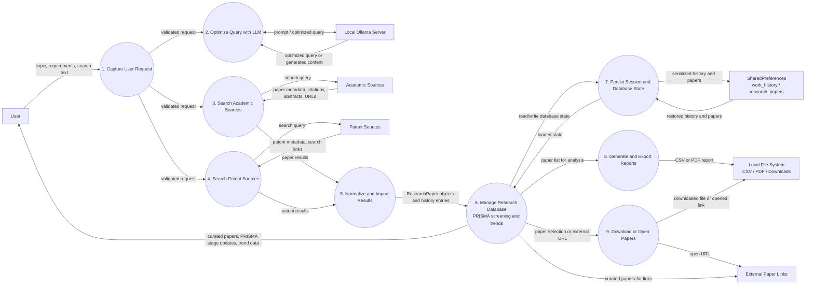

# Omicron Codebase Overview

This document provides a brief explanation of the core files and architecture in the **Omicron** Flutter project. The application is designed to help researchers manage, screen, and analyze research papers using the PRISMA (Preferred Reporting Items for Systematic Reviews and Meta-Analyses) methodology, with potential integration into large language models (LLMs) via Ollama.

## Directory Structure & Key Files

### 1. `lib/main.dart`
- **Purpose:** The entry point of the Flutter application. 
- **Key Components:**
  - `OmicronApp`: The main widget setting up the app theme (colors, fonts, Material 3) and routing to the home screen.
  - `AppTheme`: A utility class containing all standardized typography (using Google Fonts), brand colors, semantic UI colors, and shadows.
  - **Helpers:** PDF string sanitizers (`_sanitizeForPdf`, `_truncateForPdf`), ensuring safe text encoding and formatting when exporting reports.

### 2. `lib/models/research_paper.dart`
- **Purpose:** Defines the data models structuring the research analysis.
- **Key Components:**
  - `PrismaStage` (Enum): Represents the standard systematic literature review stages: `identified`, `screened`, `eligible`, `included`, and `excluded`.
  - `ResearchPaper` (Class): The main entity holding all metadata about a discovered study, including its title, authors, year, abstract, methodology, results, topic classification, and current `PrismaStage`. 

### 3. `lib/screens/database_screen.dart`
- **Purpose:** A dedicated dataset viewer interface where the user can browse their curated research papers.
- **Key Components:**
  - Supports dynamic sorting (e.g., by year), search filtering, and grouping by AI-detected topics.
  - Handles the assignment of screening outcomes (which papers get excluded/included).
  - Receives `ollamaIp` as a parameter, suggesting it can connect to local LLMs to automatically screen papers or process text data.

### 4. `lib/screens/prisma_flow_screen.dart`
- **Purpose:** A visualization screen specific to academic literature reviews.
- **Key Components:**
  - Calculates the funnel counts (e.g., how many papers started as unidentified, how many failed screening, how many were ultimately included).
  - Summarizes the findings into a formal PRISMA flowchart summary, mapping directly to standard academic publication requirements.

### 5. `lib/screens/trend_analysis_screen.dart`
- **Purpose:** Data visualization interface.
- **Key Components:**
  - Uses the `fl_chart` library to dynamically generate charts and analytical graphs based on metadata of the `ResearchPaper` list (like publication year frequency, trending keywords, etc.).
  - Supports CSV export mapping to allow further analysis in tools like Excel or Python.
  - Can optionally display `llmTrendInsights` generated by the connected AI backend.

---

### General Architecture
The project follows a standard declarative UI pattern in Flutter, separating data models into `models/` and UI definitions into `screens/`. It heavily utilizes a custom bespoke design system (`AppTheme`) with a clean Material layout tailored for productivity application experiences on desktop/web/mobile forms (inferred from the inclusion of windows/macos/linux templates in the workspace).

---

## Data Flow Diagram (DFD)

The diagrams below reflect the actual data paths in the app:
- user-entered topics, requirements, and search queries
- optional query optimization and content generation through a local Ollama server
- academic and patent retrieval from external APIs and web endpoints
- local persistence in SharedPreferences
- research-paper curation, PRISMA tracking, trend analysis, and export/download outputs

### 1. Context DFD

### 2. Level-1 DFD

### What the DFD shows

- The user is the primary source of topics, search queries, and screening actions.
- Ollama is optional but important: it can optimize queries and generate content for reports.
- Academic and patent sources are separate external entities because the app queries them differently.
- SharedPreferences stores two persistent datasets: work history and the curated research-paper list.
- The research-paper database feeds PRISMA screening, trend analysis, and report generation.
- Export and download flows write to the local file system, while paper links are opened in external browser destinations.

If you want, I can also split these diagrams into a dedicated `DFD.md` file or turn them into a cleaner visual with numbered processes and data stores.